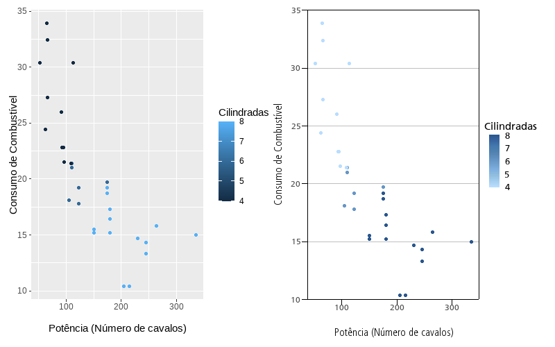

[](https://github.com/ipeadata-lab/ipeaplot/actions)
[](https://lifecycle.r-lib.org/articles/stages.html)

# ipeaplot: criando graficos no padrão editorial do Ipea 


O **ipeaplot** é um pacote em R desenvolvido para facilitar a padronização de gráficos e figuras seguindo a política editorial do Instituto de Pesquisa Econômica Aplicada (Ipea). O pacote traz algumas funções que facilitam o ajuste de formatação e de cores de gráficos criados com o pacote `ggplot2`, garantindo a conformidade com as diretrizes das publicações do Instituto.

# Instalação

Você pode instalar a versão em desenvolvimento do **ipeaplot** direto do Github:

```
# Versão em desenvolvimento
utils::remove.packages('ipeaplot')
remotes::install_github("ipeadata-lab/ipeaplot")
```
# Visão geral do pacote

O pacote **ipeaplot** foi desenhado para ser usado em conjunto com o pacote [ggplot2](https://ggplot2.tidyverse.org/), a biblioteca mais popular de visualização de dados em R. Atualmente, o **ipeaplot** inclui três funções principais:

1. `theme_ipea()` - para formatação de elementos estilísticos da figura (eixos, fontes, linhas, grid, etc.);
2. `scale_color_ipea()` e `scale_fill_ipea()`- selecionam paleta de cores dentro de um conjunto de opções utilizadas pelo Ipea;
3. `save_eps()` - salva a figura com a extensão `.eps`, um formato vetorial de alta resolução utilizado pela equipe da Coordenação do Editorial.

# Demonstração do pacote

```
# Carregue os pacotes
library(ipeaplot)
library(ggplot2)
```
No painel abaixo, à direita, temos a representação de um gráfico no formato padrão do *ggplot2*. Já à esquerda, destacamos o resultado obtido após a aplicação de linhas de código com as funções theme_ipea() e scale_color_ipea().

```
# Figura ggplot original
fig_raw <- ggplot() +
              geom_point(data = mtcars, aes(x = hp , y = mpg, color = cyl)) +
              labs(y='Consumo de Combustível',
                   x ='Potência (Número de cavalos)',
                   color='Cilindradas')

# Adicionando os padrões do Ipea
fig_raw +
      scale_color_ipea() +
      theme_ipea()
```



Mais detalhes sobre a utilização do **ipeaplot** nas vinhetas:
- [Introdução ao ipeaplot](https://ipeadata-lab.github.io/ipeaplot/articles/intro_ipeaplot.html)
- [Cookbook ipeaplot](https://ipeadata-lab.github.io/ipeaplot/articles/cookbook.html)


# Equipe 

O pacote **ipeaplot** é desenvolvido pela equipe da Coordenação-Geral de Ciência de Dados e Tecnologia da Informação (CGDTI) do Instituto de Pesquisa Econômica Aplicada (Ipea).

# Outros pacotes semelhantes
- UNHCR's [unhcrthemes](https://github.com/unhcr-dataviz/unhcrthemes)
- BBC's [bbplot](https://github.com/bbc/bbplot)
