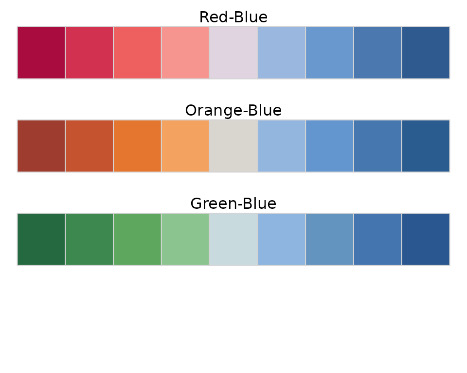
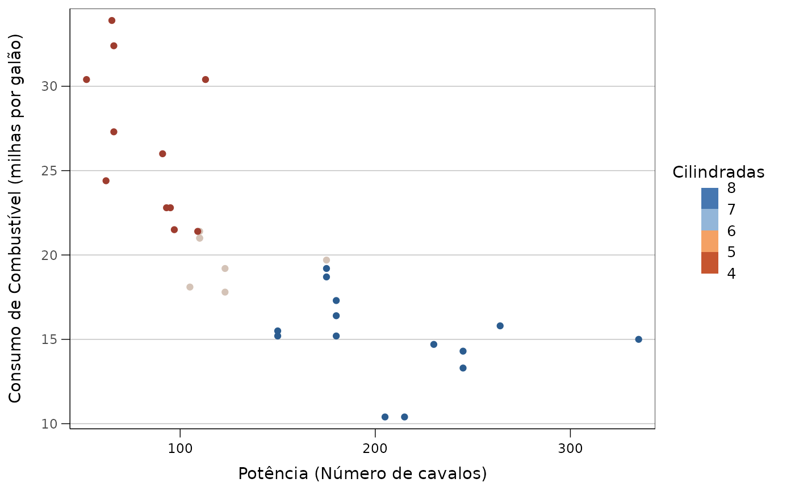
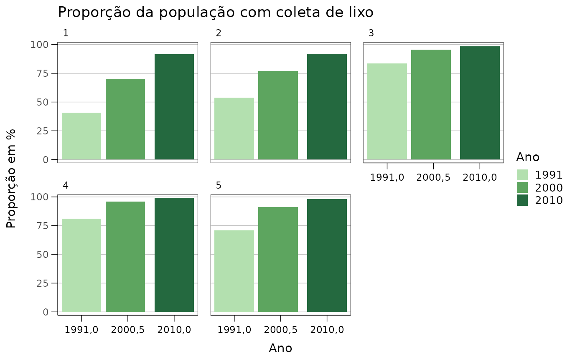
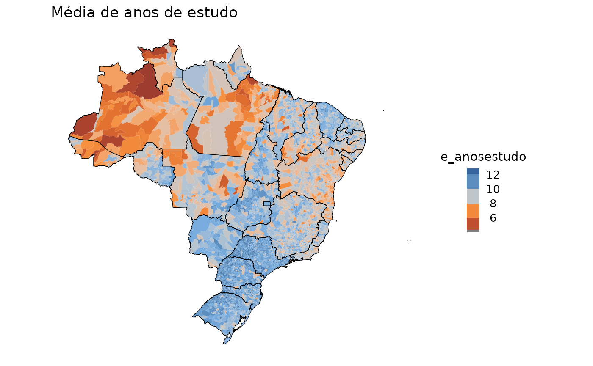

# Introdução ao ipeaplot

O **ipeaplot** é um pacote em R desenvolvido para facilitar a
padronização de gráficos e figuras seguindo a política editorial do
Instituto de Pesquisa Econômica Aplicada (Ipea). O pacote traz algumas
funções que facilitam o ajuste de formatação e de cores de gráficos
criados com o pacote `ggplot2`, garantindo a conformidade com as
diretrizes editoriais das publicações do Ipea.

## Instalação

Você pode instalar a versão em desenvolvimento do **ipeaplot** direto do
Github:

``` r
# Development version
utils::remove.packages('ipeaplot')
remotes::install_github("ipeadata-lab/ipeaplot")
```

## Visão geral do pacote.

O pacote **ipeaplot** foi desenhado para ser usado em conjunto com o
pacote [ggplot2](https://ggplot2.tidyverse.org/), a biblioteca mais
popular de visualização de dados em R. Atualmente, o **ipeaplot** inclui
quatro funções principais para ajudar você a alterar o estilo de suas
figuras de forma a seguir as diretrizes editoriais do Ipea:

1.  [`theme_ipea()`](https://ipeadata-lab.github.io/ipeaplot/reference/theme_ipea.md) -
    formatação de elementos estilísticos da figura (eixos, fontes,
    linhas, grid, etc.);
2.  [`scale_color_ipea()`](https://ipeadata-lab.github.io/ipeaplot/reference/scale_color_ipea.md)
    e
    [`scale_fill_ipea()`](https://ipeadata-lab.github.io/ipeaplot/reference/scale_fill_ipea.md)-
    selecionam paleta de cores dentro de um conjunto de opções
    utilizadas pelo Ipea;
3.  [`save_ipeaplot()`](https://ipeadata-lab.github.io/ipeaplot/reference/save_ipeaplot.md) -
    função unificada para salvar objetos ggplot em múltiplos formatos
    (`.eps`, `.pdf`, `.png`, `.jpg`), oferecendo flexibilidade e
    controle avançado sobre a exportação de figuras.

## Fontes

Por limitações de licenciamento, o **ipeaplot** utiliza, em títulos e
rótulos das figuras, a fonte sem serifa padrão do sistema operacional do
usuário e não a tipografia recomendada pelo Editorial do Ipea
(*Frutiger*). Se as figuras forem salvas em formatos “editáveis” (pdf ou
eps, usando a função
[`save_ipeaplot()`](https://ipeadata-lab.github.io/ipeaplot/reference/save_ipeaplot.md)),
a equipe editorial poderá alterar a fonte no momento da edição de uma
publicação.

## Demonstração do pacote

Primeiro, vamos carregar as bibliotecas e uma amostra de dados que
usaremos para demonstrar o **ipeaplot**. Nos exemplos a seguir, vamos
utilizar os dados `mtcars` do R.

``` r
# Load packages
library(ipeaplot)
library(ggplot2)
library(dplyr)
library(abjData)
library(geobr)
library(patchwork)

# Load mtcars dataset
data(mtcars)
```

No painel abaixo, à direita, temos a representação de um gráfico no
formato padrão do *ggplot2*. Já à esquerda, destacamos o resultado
obtido após a aplicação de linhas de código com as funções theme_ipea()
e scale_color_ipea(). Essas funções incorporam à figura diretrizes
visuais fundamentais das publicações do Ipea, proporcionando uma
apresentação alinhada aos padrões estilístico estabelecidos pelo
instituto. Nas próximas seções, vamos explorar como usar as funções do
**ipeaplot** editar as figuras seguindo essas diretrizes.

``` r
fig_raw <- ggplot() +
              geom_point(data = mtcars, aes(x = hp , y = mpg, color = cyl)) +
              labs(y='Consumo de Combustível (milhas por galão)',
                   x ='Potência (Número de cavalos)',
                   color='Cilindradas')

fig_base <- fig_raw +
              scale_color_ipea() +
              theme_ipea()

fig_base
```


### Paleta de cores

Existem duas funções básicas para selecionar a paleta de cores da
figura:
[`scale_color_ipea()`](https://ipeadata-lab.github.io/ipeaplot/reference/scale_color_ipea.md)
e
[`scale_fill_ipea()`](https://ipeadata-lab.github.io/ipeaplot/reference/scale_fill_ipea.md).
O funcionamento de ambas funções seguem a mesma lógica e parâmetros.

O parâmetro `palette` permite escolher uma paleta de cores entre as
opções de paletas utilizadas pelo Editorial do Ipea. O padrão da função
é a paleta `"Blue"`, mas o parâmetro pode receber diversas outras
opções. Isso inclui tanto paletas com cores sequenciais
(`"Blue", "Green", "Orange", "Pink"`), quanto paletes com cores
divergentes (`"Red-Blue", "Orange-Blue"`).

**Cores sequenciais:**


**Cores divergentes:**


Para usar as paletas de cores, basta adicionar uma das funções na
construção da sua figura com `ggplot2`:

``` r
# paleta sequencial verde
fig_base + scale_color_ipea(palette = "Green")
```


``` r
# paleta divergente de laranja a azul
fig_base + scale_color_ipea(palette = "Orange-Blue")
```



Além de selecionar a paleta de cores, as funções
[`scale_color_ipea()`](https://ipeadata-lab.github.io/ipeaplot/reference/scale_color_ipea.md)
e
[`scale_fill_ipea()`](https://ipeadata-lab.github.io/ipeaplot/reference/scale_fill_ipea.md)
trazem ainda outros parâmetros que permitem escolher o separador de casa
decimal (ponto ou vírgula), ajustar o tamanho da barra de legenda etc. A
lista completa de parâmetros está disponível na documentação da função
`?scale_color_ipea()`.

### Ajustando o `theme` das figuras

A função
[`theme_ipea()`](https://ipeadata-lab.github.io/ipeaplot/reference/theme_ipea.md)
aplica às figuras o padrão visual de gráficos utilizados pelo Ipea em
suas publicações. Ainda, a função traz uma maneira conveniente de
ajustar diversas características das figuras, como por exemplo os eixos,
posição da legenda, escalas dos eixos etc.

Para ilustrar essa função, vamos utilizar alguns dados do Atlas do
Desenvolvimento Humano organizados em um projeto de parceria entre Ipea,
FJP e PNUD). Para carregar os dados, basta rodar:

``` r
df <- abjData::pnud_muni
```

Essa base de dados traz para cada municipio uma série de indicadores
socioeconômicos para diferentes anos. Neste exemplo abaixo, nós primeiro
calculamos qual a proporção de domicílios que possuia coleta de esgoto
em cada região do país a cada anos, e em seguida geramos o gráfico:

``` r
# cria variavel identificando a regiao de cada municipio
df <- df |> 
      mutate(regiao = substring(uf, 1, 1),
             regiao = case_when(regiao == 1 ~ 'Norte',
                                regiao == 2 ~ 'Nordeste',
                                regiao == 3 ~ 'Sudeste',
                                regiao == 4 ~ 'Sul',
                                regiao == 5 ~ 'Centro Oeste'))

# calcula media de colega de esgoto por ano e regiao
df_fig1 <- df |>
           mutate(regiao = substring(uf, 1, 1)) |>
           group_by(ano, regiao) |>
           summarise( t_lixo = weighted.mean(x=t_lixo, w = pop)) |>
           collect()

# plot
ggplot() +
  geom_line(data = df_fig1, aes(x=ano, y=t_lixo, color= regiao)) +
  scale_color_ipea(palette = 'Orange') +
  labs(title = 'Proporção da população com coleta de lixo', color='Região') +
  ylab('Proporção em %') +
  xlab('Ano') +
  theme_ipea()
```


Os mesmos dados também poderiam ser visualizados com um gráfico de
colunas:

``` r
ggplot() + 
  geom_col(data = df_fig1, aes(x=ano, y=t_lixo, fill= factor(ano))) +
  scale_fill_ipea(palette = 'Green') +
  labs(title = 'Proporção da população com coleta de lixo', fill='Ano') +
  ylab('Proporção em %') +
  xlab('Ano') +
  facet_wrap(. ~ regiao) +
  theme_ipea(x_breaks = 3)
```



#### Mapas

As funções do **ipeaplot** também facilitam na criação de mapas. No
exemplo abaixo, nós vamos fazer um mapa choroplético que mostra a média
de anos de estudo dos municípios do Brasil.

O primeiro passo, é baixar a malha espacial de municípios. Isso pode ser
feito com o pacote [geobr](https://ipeagit.github.io/geobr/),
desenvolvido pelo Ipea. Para baixar esses dados, basta rodar:

``` r
# Load municipality and state spatial data
mun <- geobr::read_municipality(year = 2010)
uf  <- geobr::read_state(year = 2010)
```

Agora nós precisamos fazer um *merge* dos dados espaciais e dos dados
com as estimativas de anos de estudo. A variável com os códigos do
municípios é a nossa chave para unir as duas bases.

``` r
# Load municipality and state spatial data
mun = read_municipality()
uf  = read_state()

# Subset and select specific columns from the 'pnud_muni' dataset
df_escola <- df |>
             subset(ano == 2010) %>%
             select(ano, code_muni = codmun7, e_anosestudo)

# Perform a left join between the 'mun' and 'pnud' data frames
df3 <- dplyr::left_join(mun, df_escola, by = 'code_muni')
```

Agora basta criar o mapa:

``` r
ggplot() +
  geom_sf(data = df3, aes(fill = e_anosestudo), color = NA) +
  geom_sf(data = uf, color = "black", fill = NA) +
  ggtitle("Média de anos de estudo") +
  scale_fill_ipea(palette = 'Orange-Blue',
                  name='Anos de\nestudo') +
  theme_ipea(axis_lines = 'none', include_ticks = F, axis_values = F)
```



### Salvando figura

Finalmente, o pacote **ipeaplot** traz a função
[`save_ipeaplot()`](https://ipeadata-lab.github.io/ipeaplot/reference/save_ipeaplot.md)
para facilitar a exportação da figura para múltiplos formatos de
arquivo, incluindo formatos vetoriais de alta resolução como `.eps` e
`.pdf`, além de formatos raster como `.png` e `.jpg`.

A função
[`save_ipeaplot()`](https://ipeadata-lab.github.io/ipeaplot/reference/save_ipeaplot.md)
oferece uma interface unificada e flexível para salvar gráficos,
permitindo especificar múltiplos formatos simultaneamente, controlar
dimensões, qualidade, e diversas outras opções avançadas.

#### Uso básico

Para usar a função, basta passar o objeto ggplot da figura que deseja
salvar, o nome base do arquivo `file.name` (sem extensão) e
opcionalmente especificar os formatos desejados:

``` r
# Salvar apenas em EPS (formato padrão)
save_ipeaplot(fig_base, file.name = "figura_exemplo")

# Salvar em múltiplos formatos
save_ipeaplot(fig_base, 
              file.name = "figura_exemplo",
              format = c("eps", "pdf", "png"))
```

#### Parâmetros principais

A função
[`save_ipeaplot()`](https://ipeadata-lab.github.io/ipeaplot/reference/save_ipeaplot.md)
oferece diversos parâmetros para controle fino da exportação:

- **`format`**: Vetor com formatos desejados (`"eps"`, `"pdf"`, `"png"`,
  `"jpg"`)
- **`width`** e **`height`**: Dimensões da figura (padrão: 6.30 × 3.94
  polegadas)
- **`units`**: Unidades das dimensões (`"in"`, `"mm"`, `"cm"`, `"px"`)
- **`dpi`**: Resolução para formatos raster (padrão: 300)
- **`background`**: Cor de fundo (use `NA` para PNG transparente)
- **`quality`**: Qualidade para JPEG (0-100, padrão: 95)
- **`path`**: Diretório de saída (padrão: diretório atual)

#### Exemplos avançados

``` r
# Exemplo com configurações personalizadas
save_ipeaplot(fig_base,
              file.name = "figura_personalizada",
              format = c("eps", "png"),
              width = 8, height = 5,
              units = "in",
              dpi = 600,
              background = "white",
              path = "figuras/")

# Salvar com data no nome do arquivo
save_ipeaplot(fig_base,
              file.name = "figura_com_data",
              format = "pdf",
              include_date = TRUE)

# Evitar sobrescrever arquivos existentes
save_ipeaplot(fig_base,
              file.name = "figura_segura",
              format = "png",
              overwrite = FALSE)
```

A função automaticamente cria o diretório de saída se necessário e
oferece opções avançadas como uso de Cairo para melhor qualidade
vetorial e ragg para renderização raster otimizada.
