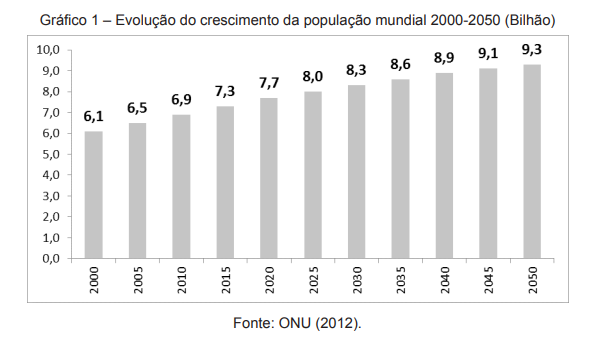

```{r, include = FALSE}
knitr::opts_chunk$set(
  collapse = TRUE,
  comment = "#>",
  eval = identical(tolower(Sys.getenv("NOT_CRAN")), "true"),
  out.width = "100%"
)
```
O **ipeaplot** é um pacote em R desenvolvido para facilitar a padronização de gráficos e figuras seguindo a política editorial do Instituto de Pesquisa Econômica Aplicada (Ipea). 

Nesta vinheta, apresentamos exemplos práticos do uso do pacote para gerar visulizações de dados comuns em textos e relatórios do Ipea. 

Em algumas figuras, os ajustes necessários para atender às diretrizes estilísticas do Editorial do Ipea demandam a criação de códigos específicos, extrapolando as configurações pré-estabelecidas no **ipeaplot**. 

Essa vinheta tem, por isso, um formato de *cookbook*, proporcionando orientações práticas para a utilização de outros recursos do `ggplot2`.

Em todos os exemplos, é exibida a versão "bruta" da figura, tal como foi submetida à Coordenação do Editorial. Em seguida, indicamos como é possível, com o **ipeaplot** e algumas linhas de código adicionais, atingir o nível de padronização necessário às publicações do Ipea.

```{r eval=TRUE, message=FALSE, warning=FALSE, results='hide'}
# Leitura de bibliotecas
library(ipeaplot)
library(ggplot2)
library(dplyr)
library(abjData)
library(geobr)
library(reshape)
library(knitr)

```

```{r eval=FALSE, message=FALSE, warning=FALSE}
# Leitura dos dados
## Gráfico 1
Ano <- factor(c(2000,2005,2010,2015,2020,2025,2030,2035,2040,2045,2050))
Populacao <- c(6.1,6.5,6.9,7.3,7.7,8.0,8.3,8.6,8.9,9.1,9.3)
labels <- as.character(Populacao)
labels <- gsub("." , "," , labels, fixed=T)
base_graf1 <- data.frame(Ano,Populacao,labels)

## Gráfico 2
Ano <- factor(c(1950,	1951,	1952,	1953,	1954,	1955,	1956,	1957,	1958,	
                1959,	1960,	1961,	1962,	1963,	1964,	1965,	1966,	1967,
                1968,	1969,	1970,	1971,	1972,	1973,	1974,	1975,	1976,
                1977,	1978,	1979,	1980,	1981,	1982,	1983,	1984,	1985,
                1986,	1987,	1988,	1989,	1990,	1991,	1992,	1993,	1994,
                1995,	1996,	1997,	1998,	1999,	2000,	2001,	2002,	2003,
                2004,	2005,	2006,	2007,	2008,	2009,	2010,	2011,	2012,
                2013,	2014))
Populacao<- c( 1.850116458,	1.791417471,	1.760491225,	1.751060624,
               1.757374206,	1.773968217,	1.795950884,	1.81926587,
               1.840930397,	1.860403495,	1.879485845,	1.90178203,
               1.931384556,	1.96968284 ,	2.011263472,  2.052385316,
               2.083875031,	2.098137208,	2.091095193,	2.06831928,
               2.043373483,	2.018775478,	1.985792138,	1.944170268,
               1.898407101,	1.850171278,	1.807798778,	1.779963926,
               1.770930519,	1.77532254 ,	1.778741317,	1.77934085,	
               1.787498884,	1.803957627,	1.823106379,	1.844715108,
               1.856490979,	1.844087147,	1.801286156,	1.7376904,
               1.669804195,	1.607655387,	1.548374095,	1.4949701,
               1.447065626,	1.399607643,  1.354384982,	1.318725392,
               1.294773864,	1.279786607,	1.268049775,	1.257045807,
               1.248951736,	1.243210965,	1.239058923,	1.236026043,
               1.23309632,	1.229128787,	1.223387196,	1.215887987,
               1.207869122,	1.198749205,	1.186540058,	1.170622969,
               1.151783904)
labels <- as.character(Populacao)
labels <- gsub("." , "," , labels, fixed=T)
base_graf2<- data.frame(Ano,Populacao, labels)

## Gráfico 3
# Valores Hipoteticos
Pais <- factor(c("Ìndia","Japão","Alemanha","Reino Unido","França",
                 "Arábia Saudita","Rússia","China","Estados Unidos"))
Gasto <- c(40,50,50,60,70,40,90,207,640)
base_graf3<- data.frame(Pais,Gasto)
base_graf3$pos <- ifelse(base_graf3$Pais == 'Estados Unidos',2,1)

library(dplyr)
base_graf3 <- base_graf3 %>%
  group_by(pos) %>%
  mutate(total = sum(Gasto))

## Gráfico 4
Ano <- seq(2009,2020,1)
Exabytes <- c(130,360,750,1400,3100,6000,10000,14000,19000,25000,31500,40000)

base_graf4 <- data.frame(Ano,Exabytes)

## Gráfico 5

Ano <- seq(2004,2013,1)
Mundo <- c(4.2,3.8,4.1,4,1.5,-2,4,2.9,2.4,2.1)
UE <- c(2.6,2.2,3.4,3.2,0.6,-4.6,2.1,1.7,-0.4,0)

base_graf5 <- data.frame(Ano,Mundo,UE)
base_graf5<- melt(base_graf5, id=c("Ano"))

## Gráfico 6
pais <- c("Áustria","Bélgica","Bulgária","Croácia","Chipre","República Tcheca",
          "Dinamarca","Estônia","Finlândia","França","Alemanha","Grécia",
          "Hungria","Irlanda","Itália","Letônia","Lituânia","Luxemburgo",
          "Malta","Holanda","Polônia","Portugal","România",
          "Eslováquia","Eslovênia","Espanha","Suécia","Reino Unido")

petroleo <- c(90,100,97,72,104,96,-37,60,90,97,96,100,
              81,102,89,104,90,98,98,97,96,98,52,89,107,96,95,38)

base_graf6 <- data.frame(pais,petroleo)

## Gráfico 7
pais <- c("África do Sul","Brasil","Federação Russa",
          "China","Índia","OCDE")

final <- c(0.695,0.55,0.43,0.413,0.38,0.315)

inicio <- c(0.67,0.61,0.4,0.33,0.32,0.297)

base_graf7 <- data.frame(pais,final,inicio)

## Gráfico 8
link <- 'https://github.com/ipeadata-lab/ipeaplot/files'
base_graf8 <- data.table::fread(paste0(link,'/12239277/dados_grafico9.csv'),
                                dec = ",", encoding = 'Latin-1')

## Gráfico 9
base_graf9 <- data.table::fread(paste0(link,'/12239278/dados_grafico10.csv'),
                                 dec = ",", encoding = 'Latin-1')

## Salvando graficos no formato Rdata
save(base_graf1,base_graf2,base_graf3,base_graf5,base_graf6,base_graf7,base_graf8,
     base_graf9,
     file='bases_de_dados.Rdata')

```


## Gráfico 1


### Original
```{r, echo=FALSE, message=FALSE, warning=FALSE, fig.align="center", out.width = "100%"}
 knitr::include_graphics(paste0(getwd(),"/prints_original/grafico1.png"))
#{fig-align="center", width='80%'}
```


### Padrão ipea
```{r eval=FALSE, message=FALSE, warning=FALSE}
graf1 <- ggplot(data=base_graf1, aes(x=as.numeric(as.character(Ano)), y=Populacao)) +
  geom_bar(stat="identity", fill = '#015f96', width=2) +
  geom_rug(aes(x = as.numeric(as.character(Ano)) - 2.5),
           outside = TRUE, sides = "b", length = unit(2, "mm"), linewidth = 0.25) +
  coord_cartesian(expand = TRUE, clip = "off") +
  labs(fill = "",
       title="GRÁFICO 1",
       subtitle="Evolução do crescimento da população mundial 2000-2050\n(Em bilhões)",
       caption = 'Fonte: United Nations (2012a).\nTradução dos autores.') +
  theme_ipea(x_breaks = 10,include_ticks = F,
             include_x_text_title = F,include_y_text_title = F) +
  geom_text(aes(label = gsub("\\.", ",",round(Populacao,1))),
            hjust = 0.5, vjust = -0.5)

```

```{r, echo=FALSE, message=FALSE, warning=FALSE, fig.align="center", out.width = "100%"}
 knitr::include_graphics(paste0(getwd(),"/prints_ipeaplot/grafico1.png"))
```


## Gráfico 2 


### Original
```{r, echo=FALSE, message=FALSE, warning=FALSE, fig.align="center", fig.width=6, fig.height=6}
knitr::include_graphics(paste0(getwd(),"/prints_original/grafico2.png"))
```


### Padrão Ipea
```{r eval=FALSE, message=FALSE, warning=FALSE}
base_graf2$Ano <- as.numeric(as.character(base_graf2$Ano))
ref <- (subset(base_graf2,substr(Ano,4,4) %in% c('5','0')))

graf2 <- ggplot(base_graf2, aes(x=Ano, y=Populacao, group = 1))+
  geom_line(color = '#015f96') +
  labs(fill = "",
       title="GRÁFICO 2",
       subtitle="Taxa de crescimento da população mundial (Em %)",
       caption = 'Elaboração dos autores.') +
  theme_ipea(x_breaks = 16, x_text_angle = 90, include_ticks = F,
             include_x_text_title = F,include_y_text_title = F) +
  geom_rug(data = ref, aes(x = Ano+2.5),inherit.aes = FALSE,
           outside = TRUE, sides = "b", length = unit(2, "mm"), linewidth = 0.25) +
  coord_cartesian(clip = "off")
```

```{r, echo=FALSE, message=FALSE, warning=FALSE, fig.align="center", out.width = "100%"}
 knitr::include_graphics(paste0(getwd(),"/prints_ipeaplot/grafico2.png"))

```


## Gráfico 3


### Original
```{r, echo=FALSE, message=FALSE, warning=FALSE, fig.align="center", fig.width=6, fig.height=6}
knitr::include_graphics(paste0(getwd(),"/prints_original/grafico3.png"))
```


### Padrão Ipea
```{r eval=FALSE, message=FALSE, warning=FALSE}
temp <- base_graf3 %>% distinct(pos, .keep_all = T)


graf3 <- ggplot(base_graf3, aes(x= as.character(pos), y=Gasto, fill=Pais,
                                label = Pais))+
  geom_bar(width = 0.5, stat = "identity", color= NA) +
  labs(y="Gastos com defesa",
       fill = "",
       title="GRÁFICO 3",
       subtitle="Gastos com defesa (Em bilhões de dólares)",
       caption = 'Fonte: Peter G. Peterson Foundation (2013).\nTradução dos autores.') +
  scale_fill_ipea() +
  geom_text( position = position_stack(vjust = 0.5), color = 'white') +
  geom_text(data = temp, aes(y = total ,label = paste0("U$ ",total)), vjust = -.5) +
  theme_ipea(legend.position="none",
             include_x_text_title = F) +
  theme(axis.ticks.x = ggplot2::element_blank(),
        axis.text.x  = ggplot2::element_blank())

```

```{r, echo=FALSE, message=FALSE, warning=FALSE, fig.align="center", out.width = "100%"}
 knitr::include_graphics(paste0(getwd(),"/prints_ipeaplot/grafico3.png"))
```


## Gráfico 4


### Original
```{r, echo=FALSE, message=FALSE, warning=FALSE, fig.align="center", fig.width=6, fig.height=6}
knitr::include_graphics(paste0(getwd(),"/prints_original/grafico4.png"))
```


### Padrão Ipea
```{r eval=FALSE, message=FALSE}
graf4 <- ggplot(base_graf4, aes(x=Ano)) +
  geom_ribbon(aes(ymin=0, ymax=Exabytes), fill = "#015f96")+
  labs(fill = "",
       title="GRÁFICO 4",
       subtitle="Evolução do volume de informação digital até 2020",
       caption = 'Fonte: IDC’s Digital Universe Study (Gantz e Reinsel, 2012).') +
  theme_ipea(legend.position="none",expand_x_limit = F,
             x_breaks = 10, y_breaks = 4,
             include_x_text_title = F,include_y_text_title = F)

```

```{r, echo=FALSE, message=FALSE, warning=FALSE, fig.align="center", out.width = "100%"}
 knitr::include_graphics(paste0(getwd(),"/prints_ipeaplot/grafico4.png"))
```


## Gráfico 5


### Original
```{r, echo=FALSE, message=FALSE, warning=FALSE, fig.align="center", fig.width=6, fig.height=6}
knitr::include_graphics(paste0(getwd(),"/prints_original/grafico5.png"))
```


### Padrão Ipea
```{r eval=FALSE, message=FALSE, warning=FALSE}
graf5 <- ggplot(base_graf5, aes(Ano, value, group=variable, color=variable))+
  geom_line(size=1)+
  geom_point(aes(shape=variable, fill = variable),
             size=3, stroke=1.5, show.legend = F)+
  labs(color = "",
       title="GRÁFICO 5",
       subtitle="Crescimento anual do PIB da União Europeia (2004-2013) (Em %)",
       caption = 'Fonte: World Bank (2014).\nTradução dos autores.\nObs.: Os dados foram coletados no sítio do Banco Mundial.\nDisponível em: <http://goo.gl/IvtZ1a>. Acesso em: 26 set. 2014.') +
  theme_ipea(x_breaks = 8, y_breaks = 10, legend.position = 'bottom', expand_x_limit = F,
             include_x_text_title = F,include_y_text_title = F) +
  scale_color_ipea(palette_direction = -1, ) +
  scale_shape_manual(values = c(19, 21)) +
  scale_fill_manual(values = c(NA,"white"))

```

```{r, echo=FALSE, message=FALSE, warning=FALSE, fig.align="center", out.width = "100%"}
 knitr::include_graphics(paste0(getwd(),"/prints_ipeaplot/grafico5.png"))
```


## Gráfico 6


### Original
```{r eval=TRUE, message=FALSE, warning=FALSE, fig.align="center", fig.width=6, fig.height=6}
knitr::include_graphics(paste0(getwd(),"/prints_original/grafico6.png"))
```


### Padrão Ipea
```{r eval=FALSE, message=FALSE, warning=FALSE}
base_graf6$pais<- factor(base_graf6$pais, levels=rev(sort(base_graf6$pais)))
graf6 <- ggplot(data=base_graf6, aes(x=pais, y=petroleo)) +
  geom_bar(stat="identity", fill = '#015f96') +
  coord_flip() +
  labs(fill = "",
       title="GRÁFICO 6",
       subtitle="Importações de energia em termos do consumo total\nde energia dos países da União Europeia",
       caption = 'Fonte: Eurostat (2014).\nTradução dos autores.') +
  theme_ipea(legend.position = 'none', expand_x_limit = F,
             include_x_text_title = F,include_y_text_title = F)

```

```{r, echo=FALSE, message=FALSE, warning=FALSE, fig.align="center", out.width = "100%"}
 knitr::include_graphics(paste0(getwd(),"/prints_ipeaplot/grafico6.png"))
```


## Gráfico 7


### Original
```{r, echo=FALSE, message=FALSE, warning=FALSE, fig.align="center", fig.width=6, fig.height=6}
knitr::include_graphics(paste0(getwd(),"/prints_original/grafico7.png"))
```


### Padrão Ipea
```{r eval=FALSE, message=FALSE, warning=FALSE}
base_graf7<- melt(base_graf7, id=c("pais"))

graf7 <- ggplot(data=base_graf7, aes(x=pais, y=value, group=variable, fill=variable)) +
  geom_bar(position='dodge',stat="identity") +
  coord_flip()+
  labs(fill = "",
       title="GRÁFICO 7",
       subtitle="Mudanças nos níveis de desigualdade do BRICS, calculadas pelo coeficiente\nGini, entre o início da década de 1990 e o final da década de 2000",
       caption = '') +
  theme_ipea(legend.position = 'bottom',
             include_x_text_title = F,include_y_text_title = F) +
  scale_fill_ipea()

```

```{r, echo=FALSE, message=FALSE, warning=FALSE, fig.align="center", out.width = "100%"}
 knitr::include_graphics(paste0(getwd(),"/prints_ipeaplot/grafico7.png"))
```


## Gráfico 8


### Original
```{r, echo=FALSE, message=FALSE, warning=FALSE, fig.align="center", fig.width=6, fig.height=6}
knitr::include_graphics(paste0(getwd(),"/prints_original/grafico8.png"))
```


### Padrão Ipea
```{r eval=FALSE, message=FALSE, warning=FALSE}
######## GRAFICO 8
base_graf8_aux <- base_graf8[,c(1,4)]
base_graf8_aux$n <- 1:nrow(base_graf8_aux)
base_graf8<- melt(base_graf8[,-4], id=c("pais"))

base_graf8 <- base_graf8 %>%
  group_by(variable) %>%
  mutate(n = 1:n())

label <- (base_graf8 %>% ungroup() %>% distinct(pais))$pais

graf8 <-
  ggplot() +
  geom_bar(data=base_graf8, aes(x=n, y=value,
                                group=variable, fill=variable),
           stat="identity", width = 0.5) +
  labs(fill = "",
       title="GRÁFICO 8",
       subtitle="Crescimento médio real do PIB em PPC (2011-2050) (Em %)",
       caption = 'Fonte: PwC (2014).\nTradução dos autores') +
  geom_line(data=base_graf8_aux, aes(x=n ,y=`crescimento do PIB (ppc)_perct`, group = 1),
            color = 'gray') +
  scale_x_continuous(breaks = 1:max(base_graf8$n), labels = label) +
  scale_fill_ipea() +
  theme_ipea(legend.position = 'bottom', x_text_angle = 90, include_ticks = F,
             include_x_text_title = F,include_y_text_title = F) +
  geom_rug(data=base_graf8, aes(x = n-0.5),
           outside = TRUE, sides = "b", length = unit(2, "mm"), linewidth = 0.25) +
  coord_cartesian(expand = FALSE, clip = "off")

```


```{r, echo=FALSE, message=FALSE, warning=FALSE, fig.align="center", out.width = "100%"}
 knitr::include_graphics(paste0(getwd(),"/prints_ipeaplot/grafico8.png"))
```
